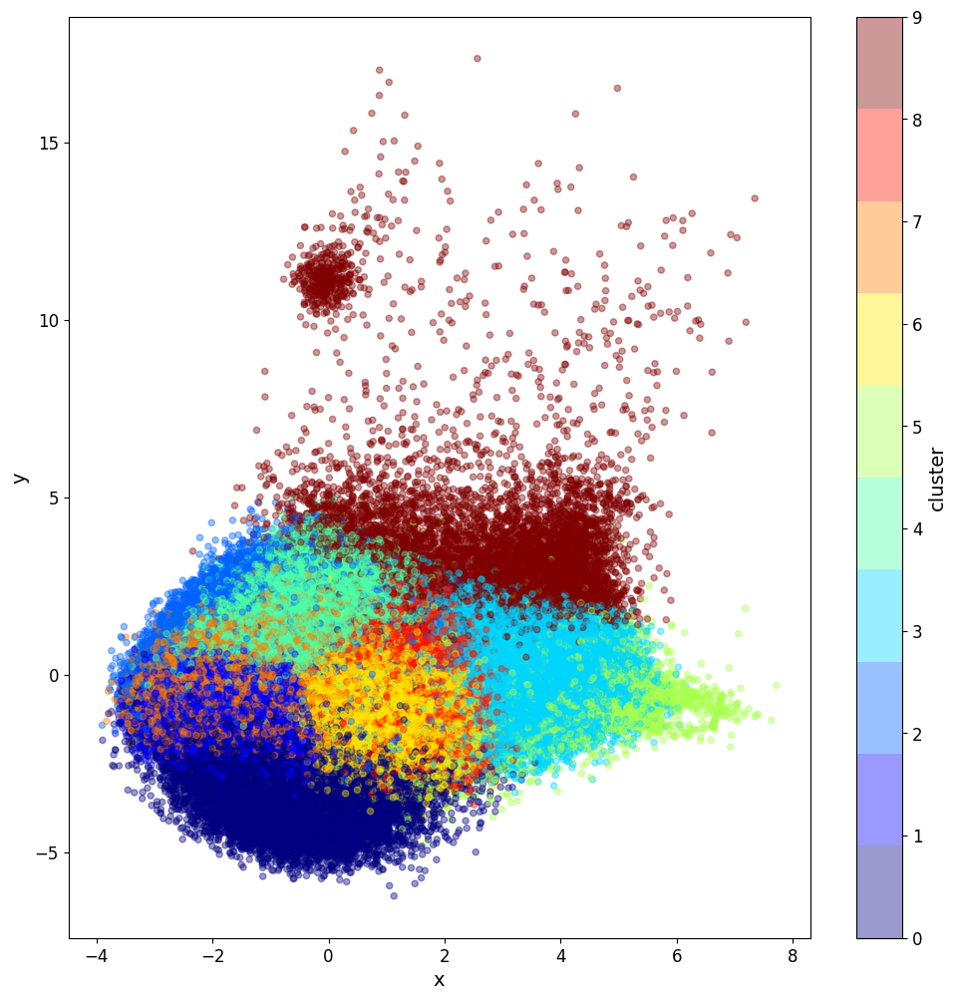
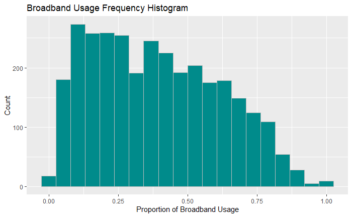
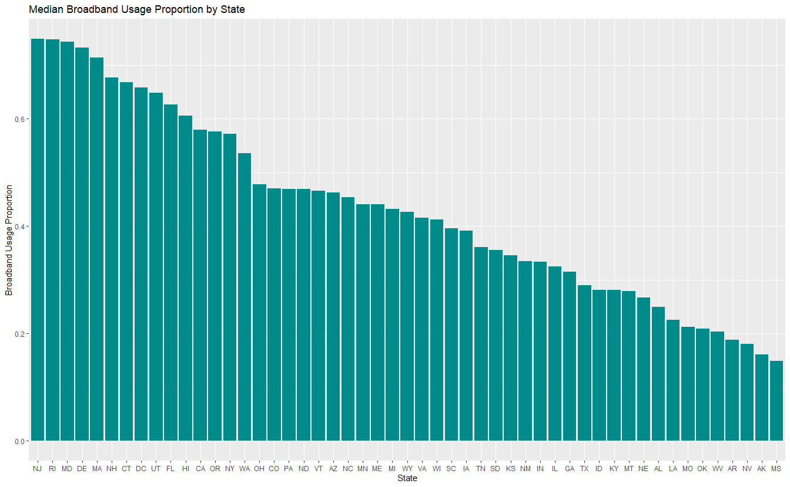
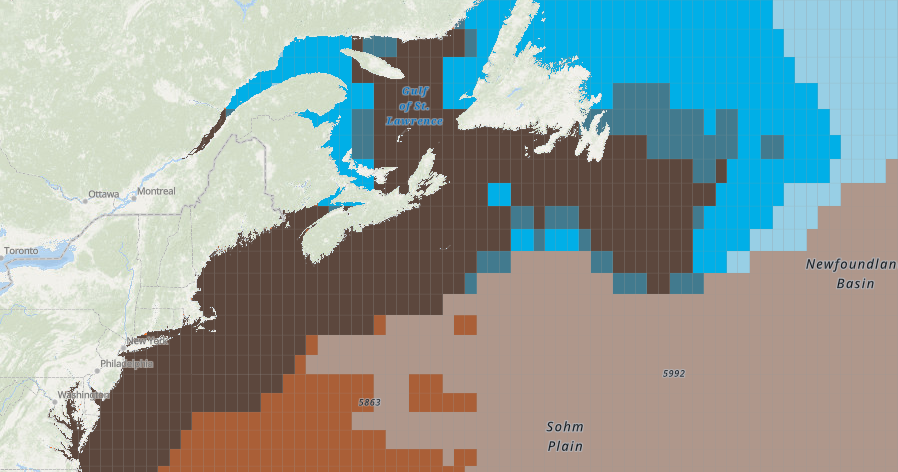
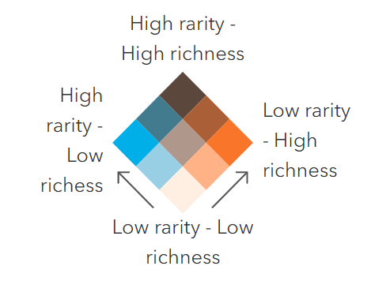
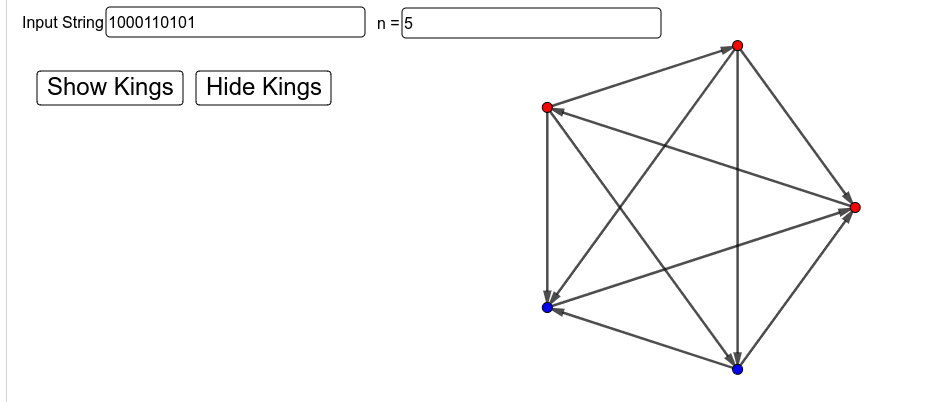

## Portfolio

---

### About Me

[Go to Projects](#projects)

Hi! I’m Shanley Camara, a geospatial data analyst with 5 years of experience at the intersection of data science, human geography, and survey research. Since graduating summa cum laude from University of New England in 2022 with a B.S. in Data Science and a minor in Biological Sciences, I’ve built a strong foundation in statistical analysis, project management, and geospatial technology.

Over the past few years, I’ve progressed from Associate to Senior Analyst, leading projects that involve complex survey design, spatial data analysis, and clear, actionable reporting. I’m highly proficient in Python, R, GitHub, and GIS tools, and I enjoy working on problems that bring together data, human behavior, and location-based insights.

Scroll down to see some examples of my work. If you would like to connect please feel free to reach out to me at shanleycamara@gmail.com or add me on [LinkedIn](https://www.linkedin.com/in/shanley-camara).

---

### Projects

#### [Spotify Recommendation System](https://github.com/scamara129/song_recommendor)
This project uses Python to create a Spotify recommendation system by comparing cosine similarity of an input song and all tracks found in this [1.2+ million song dataset](https://www.kaggle.com/datasets/rodolfofigueroa/spotify-12m-songs?reso=) from Kaggle. Clustering, an unsupervised machine learning algorithm, is utilized to reduce the processing time of this system by only comparing the input song to other songs within its cluster. I was inspired to create this to find new songs based on a song I like that is independent from artist or genre, and instead base recommendations on song composition metrics provided by Spotify's API. Some of these metrics include danceability, energy, valence, etc. that may be able to quantify the overall "vibe" of a song. This was a fun project because I got to explore some of Spotify's open developer tools like Spotify for Developers, Spotify API, and the Python package 'spotipy', and listen to some fun new songs that I may not have found otherwise.
- To see the source code and results, go to the [GitHub Repository](https://github.com/scamara129/song_recommendor)
- Skills: Python (pandas, numpy, sklearn, matplotlib), machine learning (unsupervised, clustering), data visualization, data exploration

  
  

#### [Broadband Usage Modeling](https://github.com/scamara129/broadband_usage)
Internet accessibility in the United States is greatly important for people to thrive in our society. Many rural communities may not even have internet services available at all, let alone the ability to pay and access those services at high speeds. Broadband allows people to access the internet at much faster speeds than other more outdated methods and is accessible at any time. In this project I examined broadband availability and usage by county across the United States, and then predicted broadband usage based on county census data using several machine learning techniques. Features used to predict broadband usage include broadband availability, county population, unemployment rate, percent without health insurance, poverty rate, percent receive SNAP, percent without computer, and percent without internet.
- To see source code and results, go to the [GitHub Repository](https://github.com/scamara129/broadband_usage)
- Skills: R (tidyverse, caret), machine learning (supervised, regression, linear regression, knn, elastic net, pcr), data cleaning, data wrangling, data visualization, data exploration

  
  

#### [Marine Biodiversity in the Gulf of Maine](https://arcg.is/8KP1L)
The Gulf of Maine is a particular point of interest when it comes to maintaining marine biodiversity. Through this ArcGIS Story Map, I explore the importance of biodiversity in conserving our ecosystems, the species richness and rarity in the Gulf of Maine, and the current government protections in place to conserve species in the Gulf of Maine. 
- To view the Story Map visit [https://arcg.is/8KP1L](https://arcg.is/8KP1L)
- Skills: GIS (ArcGIS, Story Maps), story telling with data

  
  

#### [Game of Thrones: A Combinatorial Game Using Graph Theory](https://github.com/scamara129/game_of_thrones)
A combinatorial game is a game in which there is no randomization (like dice or flipping a coin) and in which there is perfect information, meaning that both players know everything about the state of the game. A combinatorial game played on graphs refers to the pair-wise mathematical structure that represents relationships between objects, typically represented by vertices (the objects) and edges (lines that connect the objects.) 

The Game of Thrones is a combinatorial game played on a type of graph called a tournament. A tournament is a graph in which every pair of vertices is connected by an edge *and* every edge has a direction (i.e. point A is directed towards point B.) These are also called completed directed graphs or digraphs. Following the JavaScript code in [Trevor’s William’s 2017 dissertation](https://digitalcommons.usu.edu/cgi/viewcontent.cgi?article=7649&context=etd), I was able to recreate his tournaments applet in GeoGebra. It takes in a binary string that represents the adjacencies of the upper triangle of a tournament and creates a tournament that can show/hide any kings. This applet can help you find where the kings are in a game and when in edit mode, you can manually delete vertices to play the game. 
- Read *How to Play* in the README.md file on this [github repository](https://github.com/scamara129/game_of_thrones)
- To use the GeoGebra applet, visit [https://www.geogebra.org/m/gfc8v9dz](https://www.geogebra.org/m/gfc8v9dz)
- Skills: JavaScript, GeoGebra, combinatorics, graph theory, game theory, communication

#### Geospatial Solutions in the Property and Casualty Insurance Industry Poster
In October 2022 I had the opportunity to help present a poster at the Maine GIS User Group (MEGUG) annual meeting. With the Data team at Insurity, we created a poster presentation giving a brief overview of how we use geospatial data in our work and in the insurance industry. Our poster presentation was voted Best Poster in the professional category. 

'Insurtech' is a portmanteau that describes the relatively new movement within the insurance industry to prioritize technology and data to improve processes and profit. Geographic Information Systems (GIS) and spatial data can provide invaluable insight into property and casualty (P/&C) insurance underwriting and risk management. Improvement the databases analyses that form the foundation of P/&C insurance can affect policy-writing decisions and insurance premium costs. Additionally, geospatial data analysis may help insurers navigate current issues such as climate change.
- To view LinkedIn post about the poster, visit [here](https://www.linkedin.com/posts/spring-beinema-332a85b0_a-little-over-a-week-ago-i-had-the-opportunity-activity-6995139280561979392-6nda?utm_source=share&utm_medium=member_desktop)
- Skills: GIS, technical writing, communication

---

